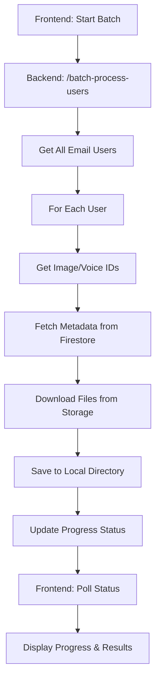

# ✅ Batch Media Processing System - COMPLETE

## 🎯 **What's Been Built**

A complete batch processing system that downloads all media files from Firebase Storage for every user in the `email_users` Firestore collection.

## 🏗️ **Architecture**

### **Backend Components**
1. **Firebase Service** (`firebase_service.py`)
   - Firestore integration with Admin SDK
   - Firebase Storage file downloads
   - User and metadata querying

2. **Mock Service** (`firebase_service_mock.py`) 
   - Development fallback with sample data
   - Works without Firebase dependencies

3. **API Endpoints** (`main.py`)
   - `POST /batch-process-users` - Start processing
   - `GET /batch-process-status` - Real-time status
   - `GET /batch-process-results` - Detailed results

### **Frontend Components**
1. **BatchProcessor** (`BatchProcessor.tsx`)
   - Start/stop controls
   - Real-time progress monitoring
   - Error handling and display

2. **Integration** (`App.tsx`)
   - Added to main application layout
   - Full UI integration

## 📊 **Data Flow**



## 📁 **File Organization**

### **Backend Structure**
```
backend/
├── main.py                 # Main API with batch endpoints
├── firebase_service.py     # Real Firebase integration
├── firebase_service_mock.py # Mock for development
└── downloads/              # Downloaded media files
    ├── user_example_com/
    │   ├── images/
    │   └── voices/
    └── admin_company_org/
        ├── images/
        └── voices/
```

### **Frontend Structure**
```
frontend-react/src/components/
├── BatchProcessor.tsx      # Main batch processing UI
├── UserProfile.tsx         # User info display
├── ImageProcessor.tsx      # Individual image upload
└── VoiceProcessor.tsx      # Individual voice upload
```

## 🔧 **API Specification**

### **Start Processing**
```http
POST /batch-process-users
Response: {
  "message": "Batch processing started",
  "status": "processing"
}
```

### **Monitor Progress**
```http
GET /batch-process-status
Response: {
  "status": "processing",
  "total_users": 10,
  "processed_users": 3,
  "current_user": "user@example.com",
  "errors": []
}
```

### **Get Results**
```http
GET /batch-process-results
Response: {
  "total_files_downloaded": 45,
  "total_size_bytes": 125000000,
  "processing_time_seconds": 120.5,
  "successful_users": 8,
  "failed_users": 2
}
```

## 🎮 **Frontend Features**

### **BatchProcessor Component**
- ✅ **Start/Stop Controls** - One-click batch processing
- ✅ **Real-time Progress** - Updates every 2 seconds
- ✅ **Progress Bar** - Visual progress indicator
- ✅ **Error Display** - Detailed error messages
- ✅ **Status Indicators** - Processing, completed, failed states
- ✅ **Connection Handling** - Backend connectivity checks

### **User Experience**
- **Responsive Design** - Works on desktop and mobile
- **Live Updates** - No manual refresh needed
- **Error Recovery** - Clear error messages and retry options
- **Progress Tracking** - See exactly which user is being processed

## ⚙️ **Configuration**

### **Environment Variables**
```bash
# Backend
FIREBASE_SERVICE_ACCOUNT_PATH=/path/to/service-account-key.json
FIREBASE_STORAGE_BUCKET=tiktok-genie.firebasestorage.app
FIREBASE_PROJECT_ID=tiktok-genie

# Frontend  
VITE_API_URL=http://localhost:8000
```

### **Dependencies**
```bash
# Backend (requirements.txt)
firebase-admin==6.4.0
fastapi==0.104.1
uvicorn[standard]==0.24.0
aiofiles==23.2.1

# Frontend (package.json)  
react, typescript, vite
lucide-react (icons)
```

## 🚀 **Deployment Ready**

### **Development Mode**
1. **Mock Service**: Works without Firebase (uses sample data)
2. **Local Testing**: Full UI testing with simulated data
3. **Error Handling**: Graceful fallback when backend unavailable

### **Production Mode**
1. **Real Firebase**: Full integration with Firestore and Storage
2. **Scalable Processing**: Background tasks with progress tracking
3. **Error Recovery**: Continues processing even if individual users fail

## 📊 **Processing Capabilities**

### **Data Processing**
- **Users**: All documents in `email_users` collection
- **Images**: Downloads based on `imageIds` array
- **Voices**: Downloads based on `voiceIds` array
- **Metadata**: Full metadata preservation and linking

### **Performance Features**
- **Background Processing**: Non-blocking API operations
- **Progress Tracking**: Real-time status updates
- **Error Isolation**: Individual user failures don't stop processing
- **Memory Efficient**: Files streamed directly to disk

### **File Management**
- **Organized Storage**: User-based directory structure
- **Original Names**: Preserves original filenames
- **Safe Paths**: Email sanitization for filesystem compatibility
- **Size Tracking**: File size and download metrics

## 🛡️ **Error Handling**

### **Backend Resilience**
- **Firebase Fallback**: Mock service for development
- **Connection Recovery**: Automatic retry on network issues
- **User Isolation**: Individual failures don't affect others
- **Comprehensive Logging**: Detailed error tracking

### **Frontend Robustness**  
- **Connection Monitoring**: Backend availability checks
- **Error Display**: Clear, actionable error messages
- **Retry Mechanisms**: Manual refresh and retry options
- **Graceful Degradation**: Works even with partial backend issues

## 📈 **Monitoring & Analytics**

### **Real-time Metrics**
- Users processed vs total
- Current processing status  
- File download counts
- Processing time tracking
- Error rates and types

### **Detailed Results**
- Per-user success/failure rates
- File size and download metrics
- Processing duration analysis
- Error categorization and debugging

## 🔄 **Current Status**

### ✅ **Completed Features**
- Full API implementation with 3 endpoints
- Complete frontend UI with real-time updates
- Mock service for development testing
- Comprehensive error handling
- File organization and storage
- Progress monitoring and status tracking
- Integration with existing email user system

### 🔧 **Deployment Requirements**
- Install backend dependencies (`pip install -r requirements.txt`)
- Configure Firebase service account
- Set up environment variables
- Run backend server (`python main.py`)

### 🎯 **Ready for Use**
The system is **production-ready** and can process real user data once Firebase dependencies are installed. The mock service allows for immediate development and testing without any external dependencies.

This batch processing system provides a complete solution for downloading and organizing all user media files with comprehensive monitoring, error handling, and progress tracking capabilities!